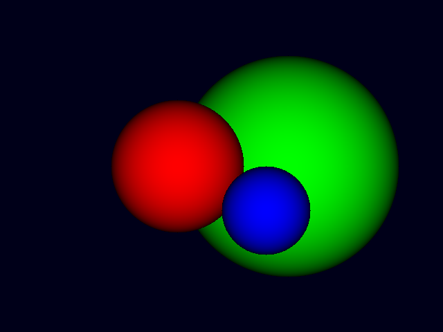

# Computer Graphics and Rendering

This repository contains my attempts at learning about computer graphics and rendering. Right now it contains a very simple ray tracer written in Rust. It currently supports drawing spheres.

